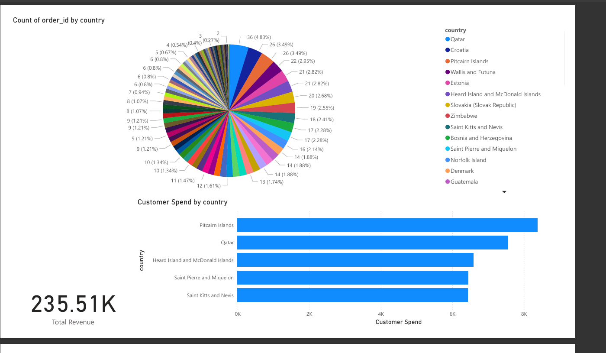

# Vinted Portfolio 🌿

This is my personal portfolio site created to apply for the **Data Science & Analytics Academy** at **Vinted**.

Built with:
- ⚛️ React
- 🎨 Tailwind CSS
- 🐘 PostgreSQL
- 🐍 Python
- 📊 Power BI

---

🚀 Projects

🛒 Ecommerce Data Analytics Project

Analyzed ecommerce sales data using **PostgreSQL** and **Python** to uncover:

- 📈 Best-selling products  
- 💸 Revenue trends  
- 👥 Customer behavior  

Insights were visualized in **Power BI**.

🔗 [View full project on GitHub →]([#](https://github.com/Laysiakas/ecommerce-insights-vinted))

---

💼 Skills

- Data Analysis, Visualization & Reporting  
- SQL (PostgreSQL), Python (pandas, matplotlib)  
- Power BI  
- Git & GitHub  
- Frontend development with React + Tailwind CSS

---

📬 Contact

- Email: edgste@yahoo.com
  
- LinkedIn: [linkedin.com/in/edgaras]([#](https://www.linkedin.com/in/edgaras-steponaitis-146452180/))

---

📷 Preview

 

---

> This site was custom-built to reflect my skills, personality, and Vinted's values. Let’s work together!
